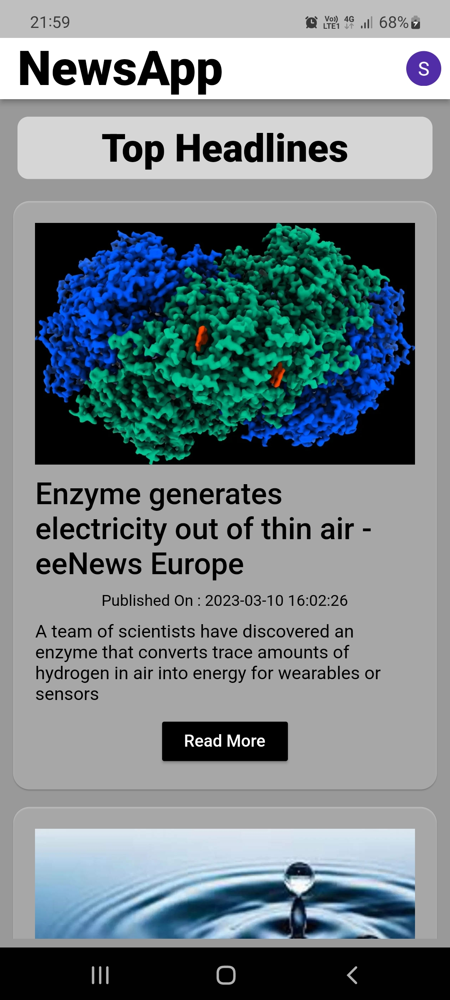
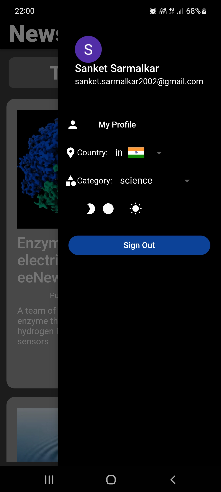

# News_app
News_App is a news app built with Flutter that displays top news from newsapi.org. The app includes a home page that displays top news, and a sidebar which contains contrains such as category, country and mode, where users can choose from a range of news categories. The app also features a smooth and intuitive design with gestures and a seamless experience on Android platform.

## Feature
- [X] Top Headlines of daily news.
- [X] Filter daily news by category.
- [X] Refresh list daily news with pull to refresh style.
- [X] Go to detail news website.
- [X] Search news.
- [X] Easy Authenticate using email or google account.
- [X] Get news of 55 Countries.
- [X] Dark mode support.

## Screens

## Getting Started

This project is a starting point for a Flutter application.

A few resources to get you started if this is your first Flutter project:

- [Lab: Write your first Flutter app](https://docs.flutter.dev/get-started/codelab)
- [Cookbook: Useful Flutter samples](https://docs.flutter.dev/cookbook)

For help getting started with Flutter development, view the
[online documentation](https://docs.flutter.dev/), which offers tutorials,
samples, guidance on mobile development, and a full API reference.
